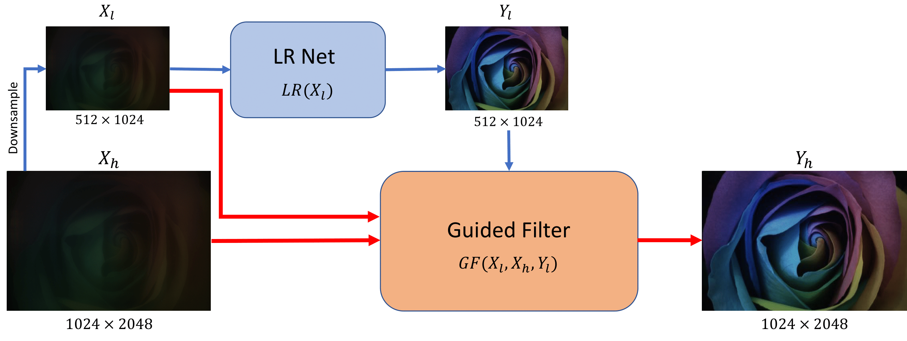

# Deep Atrous Guided Filter

Our submission to the [Under Display Camera Challenge (UDC)](https://rlq-tod.github.io/challenge2.html) at ECCV 2020. We placed **2nd** and **5th** on the POLED and TOLED tracks respectively!

[Project Page](https://varun19299.github.io/deep-atrous-guided-filter/) | [Paper](https://arxiv.org/abs/2008.06229) | [](https://colab.research.google.com/github/varun19299/deep-atrous-guided-filter/blob/master/demo_DAGF.ipynb)



Official implementation of our ECCVW 2020 paper, "Deep Atrous Guided Filter for Image Restoration in Under Display Cameras",
[Varun Sundar<sup>*</sup>](mailto:vsundar4@wisc.edu), [Sumanth Hedge<sup>*</sup>](mailto:sumanth@smail.iitm.ac.in), [Divya K Raman](mailto:ee15b085@smail.iitm.ac.in), [Kaushik Mitra](mailto:kmitra@ee.iitm.ac.in).
Indian Institute of Technology Madras, * denotes equal contribution.

## Quick Collab Demo

If you want to experiment with Deep Atrous Guided Filter (DAGF), we recommend you get started with the [collab notebook](https://colab.research.google.com/github/varun19299/deep-atrous-guided-filter/blob/master/demo_DAGF.ipynb). It exposes the core aspects of our method, while abstracting away minor details and helper functions.

It requires no prior setup, and contains a demo for both POLED and TOLED measurements.

If you're unfamiliar with Under Display Cameras, they are a new imaging system for smartphones, where the camera is mounted right under the display. This makes truly bezel-free displays possible, and opens up a bunch of other applications. You can read more [here](https://yzhouas.github.io/projects/UDC/udc.html).

## Get Started

If you would like to reproduce **all** our experiments presented in the paper, head over to the [experiments](https://github.com/varun19299/deep-atrous-guided-filter/tree/experiments) branch. For a concise version with just our final models, you may continue here.


You'll need to install the following:

* python 3.7+
* pytorch 1.5+
* Use `pip install -r utils/requirements.txt` for the remaining

## Data

| Dataset         | Train Folder  | Val Folder  | Test Folder  |
|-----------------|---------------|-------------|--------------|
| POLED           | [POLED_train](https://drive.google.com/drive/folders/1LQ6BsrDkVyrIMRFZVCnVfK8NFZU0Q0OG?usp=sharing) | [POLED_val](https://drive.google.com/open?id=1C5TCLPb1GNiA4MtPOiScvWkRqYK21wC3&authuser=ee16b068%40smail.iitm.ac.in&usp=drive_fs) | [POLED_test](https://drive.google.com/open?id=1-sygEnW4iHOt-BXgV8sk7w0NIEfJi8gi&authuser=ee16b068%40smail.iitm.ac.in&usp=drive_fs) |
| TOLED           | [TOLED_train](https://drive.google.com/open?id=16kwzG4W0R2Rbo-hrF3WvcHS6zYZqrtX8&authuser=ee16b068%40smail.iitm.ac.in&usp=drive_fs) | [TOLED_val](https://drive.google.com/open?id=1LZgub138kVcAfWq2KmnCtxFcZ8mZDF-c&authuser=ee16b068%40smail.iitm.ac.in&usp=drive_fs) | [TOLED_test](https://drive.google.com/open?id=1-yT5qbtq_PO37XjDNAcXicFHL9SKwc7E&authuser=ee16b068%40smail.iitm.ac.in&usp=drive_fs) |
| Simulated POLED | [Sim_train](https://drive.google.com/open?id=1ypjm3aGBkHDuX4v1918bifRLMaRMlXba&authuser=ee16b068%40smail.iitm.ac.in&usp=drive_fs)   | [Sim_val](https://drive.google.com/open?id=1fCjccclAjXLUsCc_wNDqn0jCi53faVB0&authuser=ee16b068%40smail.iitm.ac.in&usp=drive_fs)   | NA           |
| Simulated TOLED | [Sim_train](https://drive.google.com/open?id=1ypjm3aGBkHDuX4v1918bifRLMaRMlXba&authuser=ee16b068%40smail.iitm.ac.in&usp=drive_fs)   | [Sim_val](https://drive.google.com/open?id=1fCjccclAjXLUsCc_wNDqn0jCi53faVB0&authuser=ee16b068%40smail.iitm.ac.in&usp=drive_fs)   | NA           |

Download the required folder and place it under the `data/` directory. The train and val splits contain both low-quality measurements (`LQ` folder) and high-quality groudtruth (`HQ` folder). The test set contains only measurements currently.

We also provide our simulated dataset, based on training a shallow version of DAGF with [Contextual Bilateral (CoBi)](https://ceciliavision.github.io/project-pages/project-zoom.html) loss. For simulation specific details (procedure etc.) take a look at the [experiments](https://github.com/varun19299/deep-atrous-guided-filter/tree/experiments) branch.

## Configs and Checkpoints

We use [sacred](https://sacred.readthedocs.io) to handle config parsing, with the following command-line invocation:

```bash
python train{val}.py with config_name {other flags} -p
```

Various configs available:

| Model      | Dataset                          | Config Name      | Checkpoints          |
|------------|----------------------------------|------------------|----------------------|
| DAGF       | POLED                            | ours_poled       | [ours-poled](https://drive.google.com/open?id=1FYtOhVx2Hni1nfTe4K-hYFwLvJSZjglw&authuser=ee16b068%40smail.iitm.ac.in&usp=drive_fs)       |
| DAGF-sim   | Simulated POLED                  | ours_poled_sim   | [ours-poled-sim](https://drive.google.com/open?id=1Fa4vB7BtCzDqgxFd0fWZoObZL_bc0Dor&authuser=ee16b068%40smail.iitm.ac.in&usp=drive_fs)   |
| DAGF-PreTr | POLED (fine-tuned from DAGF-sim) | ours_poled_PreTr | [ours-poled-PreTr](https://drive.google.com/open?id=1FeT-UOR97_iaz_Ed9CxwXpQ545191FZk&authuser=ee16b068%40smail.iitm.ac.in&usp=drive_fs) |
| DAGF       | TOLED                            | ours_toled       | [ours-toled](https://drive.google.com/open?id=1FZjAploCQNN5L7ngoZVHiFl6edARyoeH&authuser=ee16b068%40smail.iitm.ac.in&usp=drive_fs)       |
| DAGF-sim   | Simulated TOLED                  | ours_toled_sim   | [ours-toled-sim](https://drive.google.com/open?id=1Fcydhd346CSPb2vEWc1V2uU7dMFtSN3K&authuser=ee16b068%40smail.iitm.ac.in&usp=drive_fs)   |
| DAGF-PreTr | TOLED (fine-tuned from DAGF-sim) | ours_toled_PreTr | [ours-toled-PreTr](https://drive.google.com/open?id=1FgsHTUHl6oZBQuGp3eU48JNdtUEiyuAS&authuser=ee16b068%40smail.iitm.ac.in&usp=drive_fs) |

Download the required checkpoint folder and place it under `ckpts/`. 

DAGF-sim networks are first trained on simulated data. To obtain this data, we trained a shallow version of our final model to transform clean images to Glass/ POLED / TOLED. You can find the checkpoints and code to these networks in our [experiments](https://github.com/varun19299/deep-atrous-guided-filter/tree/experiments) branch.

Further, see `config.py` for exhaustive set of config options. To add a config, create a new function in `config.py and add it to `named_configs`. 

## Directory Setup

Create the following symbolic links (assume `path_to_root_folder/` is `~/udc_net`):

* Data folder: `ln -s /data_dir/ ~/udc_net`
* Runs folder: `ln -s /runs_dir/ ~/udc_net`
* Ckpts folder: `ln -s /ckpt_dir/ ~/udc_net`
* Outputs folder: `ln -s /output_dir/ ~/udc_net`

### High Level Organisation 

**Data folder**: Each subfolder contains a data split.

```shell
|-- Poled_train
|   |-- HQ
|   |-- |-- 101.png
|   |-- |-- 102.png
|   |-- |-- 103.png
|   `-- LQ
|-- Poled_val
|   `-- LQ
```

Splits: 
* Poled_{train,val}: Poled acquired images, HQ (glass), LQ (Poled) pairs.
* Toled_{train,val}: Toled acquired images, HQ (glass), LQ (Toled) pairs.
* Sim_{train,val}: our simulated set.
* DIV2K: source images used for train Poled, Toled in monitor acquisition. Used to train sim networks.

**Outputs folder**: Val, test dumps under various experiment names.

```shell
outputs
|-- ours-poled
|   |-- test_latest
|   |-- val_latest
        |-- 99.png
        |-- 9.png
        `-- metrics.txt
```

**Ckpts folder**: Ckpts under various experiment names. We store every 64th epoch, and every 5 epochs prior for model snapshots. This is mutable under `config.py`.

```shell
ckpts
|-- ours-poled
|   `-- model_latest.pth
```

**Runs folder:** Tensorboard event files under various experiment names.

```shell
runs
|-- ours-poled
|   |-- events.out.tfevents.1592369530.genesis.26208.0
```

## Train Script

Run as:
`python train.py with xyz_config {other flags}`

For a multi-gpu version (we use pytorch's `distributed-data-parallel`):

`python -m torch.distributed.launch --nproc_per_node=3 --use_env train.py with xyz_config distdataparallel=True {other flags}`

## Val Script

Run as:
`python val.py with xyz_config {other flags}`

Useful Flags:

* `self_ensemble`: Use self-ensembling. Ops may be found in `utils/self_ensembling.py`.

See config.py for exhaustive set of arguments (under `base_config`).

## Citation

If you find our work useful in your research, please cite:

```
@misc{sundar2020deep,
title={Deep Atrous Guided Filter for Image Restoration in Under Display Cameras},
author={Varun Sundar and Sumanth Hegde and Divya Kothandaraman and Kaushik Mitra},
year={2020},
eprint={2008.06229},
archivePrefix={arXiv},
primaryClass={cs.CV}
}
```

Openaccess version will be updated soon.

## Contact

Feel free to mail us if you have any questions!
